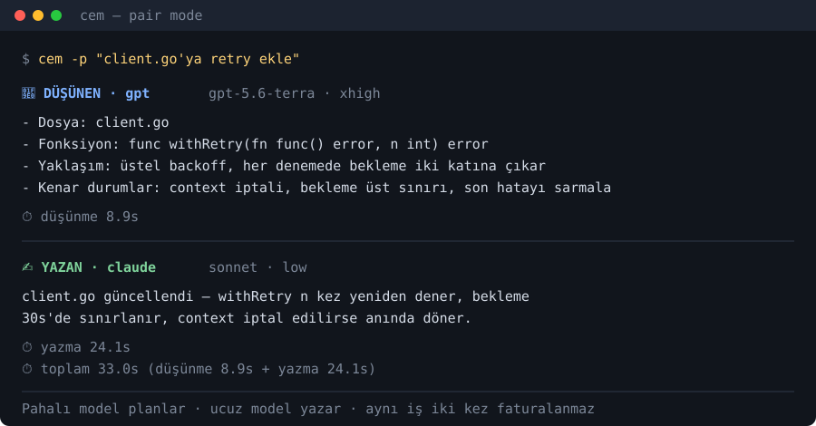

# ⚡ CEM

```
   ██████╗███████╗███╗   ███╗
  ██╔════╝██╔════╝████╗ ████║
  ██║     █████╗  ██╔████╔██║
  ██║     ██╔══╝  ██║╚██╔╝██║
  ╚██████╗███████╗██║  ╚═╝ ██║
   ╚═════╝╚══════╝╚═╝      ╚═╝
```

**One command, many AIs.** One AI thinks, another writes the code.

Use a strong model for the thinking and a cheap one for the typing — you get
better decisions without paying premium rates for every line of code.

[](https://plugins.jetbrains.com/plugin/34196)
[](https://plugins.jetbrains.com/plugin/34196)
[](https://github.com/muslu/cem/releases/latest)



---

## Install

```sh
curl -fsSL cem.pw/install | sh        # macOS / Linux / WSL
```
```powershell
irm cem.pw/install | iex              # Windows (PowerShell)
```

JetBrains IDE plugin: **Settings → Plugins → Marketplace → search `cem`**
([listing](https://plugins.jetbrains.com/plugin/34196)). VS Code and the other
editors: [README_DETAILS.md](README_DETAILS.md).

## Use

```sh
cem "what is a B-tree?"           # ask the thinker
cem -w "write a quicksort in Go"  # ask the writer
cem -p "add retries to client.go" # pair: thinker plans, writer codes
```

The first run opens a short wizard: pick your language, pick which AI thinks
and which one writes. That's it.

```
  🧠 THINKING · gpt  gpt-5.6-terra · xhigh
  - File: retry.go
  - Function: func withRetry(fn func() error, n int) error
  - Edge cases: context cancellation, exponential backoff cap
  ⏱ thinking 8.9s
  ────────────────────────────────────────────────────
  ✍️  WRITING · claude  sonnet · low
  retry.go created — withRetry retries n times with capped backoff.
  ⏱ writing 24.1s
  ⏱ total 33.0s   (thinking 8.9s + writing 24.1s)
```

---

## More

- **[README_DETAILS.md](README_DETAILS.md)** — every command, IDE plugins, API
  keys, models, reasoning effort, troubleshooting
- [ADVANCED.md](ADVANCED.md) — project configs, build from source, internals
- Türkçe: [README.tr.md](README.tr.md)
- Site: [cem.pw](https://cem.pw)

MIT — see [LICENSE](LICENSE).
