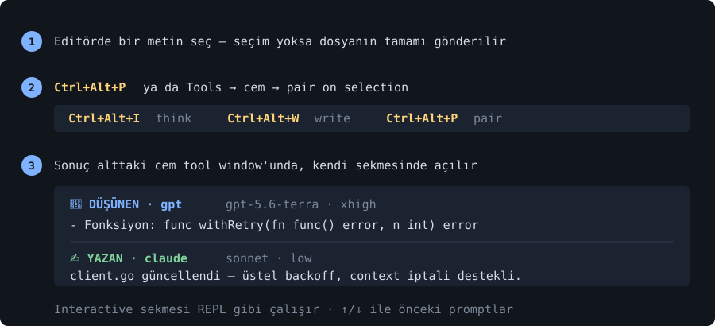

# CEM — ayrıntılı kılavuz

[README](README.tr.md)'nin ötesindeki her şey. English:
[README_DETAILS.md](README_DETAILS.md).

- [1. Kurulum](#1-kurulum)
- [2. İlk çalıştırma](#2-i̇lk-çalıştırma)
- [3. Üç komut](#3-üç-komut)
- [4. Dil](#4-dil)
- [5. Model ve düşünme seviyesi](#5-model-ve-düşünme-seviyesi)
- [6. Giriş ve API key'leri](#6-giriş-ve-api-keyleri)
- [7. Çıktı](#7-çıktı)
- [8. Güncelleme / kaldırma](#8-güncelleme--kaldırma)
- [9. IDE entegrasyonları](#9-ide-entegrasyonları)
- [10. İndirmeler](#10-i̇ndirmeler)
- [11. Sorun giderme](#11-sorun-giderme)

---

## 0. Faturayı düşük tutan varsayılanlar

Hiçbir şey ayarlamana gerek yok. cem kutudan çıktığı hâliyle pahalı model karar
verecek, ucuz model yazacak şekilde kurulu:

| Varsayılan | Neden |
|---|---|
| Pair modunda düşünen **kod yazmaz** | yoksa iki model de görevi çözer, aynı iş iki kez faturalanır |
| Düşünen seviyesi **high**, yazan **low** | planı düşünen çıkarır; yazan yalnızca uygular |
| Düşünenin cevapları **önbelleğe alınır** | aynı soruyu ikinci kez sormak aynı akıl yürütmeyi ikinci kez ödemek olmasın |
| İki rol de **önbellekli** | aynı istek aynı cevabı verir; yazan rolün kaydı ürettiği dosyaları da taşır ve geri yazılır |
| **Hızlı mod açık** | aracın hook/izin kuralları her çağrıda yeniden yüklenmez — ölçüldü: 124s → 8s |
| Yazılacak bir şey yoksa yazan **atlanır** | kod işi değilse ya da düşünen eksik bilgi sorduysa |
| Araç banner ve logları **filtrelenir** | yazana giden prompt'u da şişiriyorlar |

`cem doctor` bu kurulumu denetler ve gereğinden fazla ödediğin yeri söyler.
Tüm varsayılanlar değiştirilebilir — aşağıdaki bölümlere bak.

## 1. Kurulum

**macOS / Linux / WSL:**
```sh
curl -fsSL cem.pw/install | sh
```

**Windows (PowerShell — CMD değil, Git Bash değil):**
```powershell
irm cem.pw/install | iex
```

PATH'ine üç komut gelir:

| Komut | İşi |
|---|---|
| `cem` | orkestratör |
| `cemi` | AI CLI'larını kurar (claude, agy, gpt/codex, cursor) |
| `cemir` | kaldırır |

## 2. İlk çalıştırma

```sh
cem "fibonacci nedir?"
```

İlk seferde kısa bir sihirbaz açılır ve sırayla sorar:

1. **Dil** — Türkçe veya İngilizce (sonrası hep o dilde)
2. **Hangi AI düşünsün**, **hangisi yazsın**
3. Her biri için **model** (Enter = CLI'nın kendi varsayılanı)
4. CLI destekliyorsa her biri için **düşünme seviyesi**

Araç kurulu değilse cem kurmayı teklif eder. Node.js gibi bir önkoşul eksikse
onu da kurar — `winget` (Windows), `brew` (macOS) veya `nvm` (Linux) ile.

İstediğin zaman tekrar çalıştır: `cem setup`.

## 3. Üç komut

```sh
cem "şu kod tabanını açıkla"        # DÜŞÜNEN — tek AI
cem -w "Go'da quicksort yaz"        # YAZAN — tek AI
cem -p "bana bir CLI aracı yap"     # PAIR — düşünen planlar, yazan kodlar
```

Aracın asıl anlamı pair modunda. Düşünene açıkça **kod yazma** deniyor: kısa
bir plan çıkarıyor (hangi dosya, hangi imza, hangi yaklaşım, hangi kenar
durumlar) ve bu plan yazana "tekrar analiz etme, sadece uygula" talimatıyla
veriliyor.

Token tasarrufu tam olarak bu ayrımdan geliyor. Ayrım olmasa iki model de
görevin tamamını çözer ve aynı iş iki kez faturalanır — pahalı olanı da dahil.

Yazılacak bir şey yoksa yazan atlanır: istek bir kod işi değilse ve düşünen
kod bloğu üretmediyse cem düşünenden sonra durur.

Girdi dosyadan veya pipe'tan da gelebilir:

```sh
cem -f main.go -p "bunu context-aware yap"
git diff | cem -p "bu değişikliği incele"
```

## 4. Dil

```sh
cem lang           # mevcut dil ve nereden geldiği
cem lang tr        # Türkçe
cem lang en        # English
```

Öncelik: `CEM_LANG` ortam değişkeni → `~/.cem/config.yaml` → sistem dili
(`LANG`) → İngilizce.

## 5. Model ve düşünme seviyesi

```sh
cem model                        # araç başına aktif model + kaynağı
cem model gpt                    # o aracın bilinen modelleri
cem model gpt gpt-5.6-terra      # global ayarla
cem model --here claude sonnet   # sadece bu proje (.cem.yaml)
cem model gpt default            # kaldır — CLI kendi seçer
```

```sh
cem effort                       # araç başına aktif düşünme seviyesi
cem effort gpt xhigh             # global ayarla
cem effort --here claude low     # sadece bu proje
cem effort gpt default           # kaldır
```

| Araç | Model bayrağı | Düşünme seviyeleri |
|---|---|---|
| claude | `--model` | low, medium, high, xhigh, max |
| gpt (codex) | `--model` | low, medium, high, xhigh, max |
| cursor | `--model` | — |
| agy | — (henüz bayrak yok) | — |

Seviyeler öneridir: kabul edilen küme modele göre değişir. Araç reddederse cem
sessizce başarısız olmak yerine neyi kabul ettiğini söyler.

**Pair modu için önerilen kurulum** — pahalı model düşünür, ucuz model yazar:

```sh
cem model  gpt    gpt-5.6-terra
cem effort gpt    xhigh
cem model  claude sonnet
cem effort claude low
```

`cem roles` kurulumun tamamını tek bakışta gösterir:

```
┌── Aktif Roller ────────────────────────────────────────┐
│ 🧠 thinker   gpt · gpt-5.6-terra · xhigh   cem "soru"  │
│ ✍️  writer   claude · sonnet · low         cem -w "…"  │
│ 🤝 pair      gpt → claude                  cem -p "…"  │
└────────────────────────────────────────────────────────┘
```

Proje bazlı ayarlar kodunun yanındaki `.cem.yaml` dosyasında durur ve global
config'i ezer:

```yaml
roles:
  thinker: gpt
  writer: claude
models:
  gpt: gpt-5.6-terra
  claude: sonnet
efforts:
  gpt: xhigh
  claude: low
```

Oluşturmak için `cem init` (sihirbaz) veya `cem init gpt claude` (doğrudan).

### Terminalsiz kurulum (GUI, betik, CI)

cem kurulum yapılmadan çalışmıyor ve sihirbaz terminal istiyor. Terminal
olmayan yerlerde — IDE eklentisi, kurulum betiği, CI — bayraklarla yapılandır:

```sh
cem setup --thinker gpt --writer claude
cem setup --thinker ollama --endpoint-thinker 192.168.1.10:11434 \
          --model-thinker qwen3-coder --writer claude
cem setup --lang en                      # sadece dil, roller değişmez
cem status --json                        # makine-okur durum
```

`cem setup` kaydetmeden önce doğruluyor: bilinmeyen araç reddediliyor (yakın ad
önerilerek), model adı olmayan HTTP sunucusu reddediliyor, aracın
desteklemediği effort seviyesi reddediliyor. `cem status --json` banner ve
güncelleme bildirimi basmıyor — o tek satır karşı taraftaki ayrıştırmayı
kırıyordu.

JetBrains eklentisi tam olarak bu iki komutu kullanıyor: **Settings → Tools →
cem** `cem status --json` okuyor, Apply `cem setup` çalıştırıyor. Böylece
`~/.cem/config.yaml`'i yazan tek yer cem.

### Yerel ve kendi sunucundaki modeller (ollama · LM Studio · unsloth)

Bu üçü CLI değil — cem onlarla HTTP üzerinden konuşur, dolayısıyla kurulacak
bir şey yok: adres verirsin. Sunucu başka bir makinede de olabilir (LAN'daki
GPU kutusu, reverse proxy arkasındaki kiralık sunucu).

```sh
cem endpoint                                # ayarlı sunucular
cem endpoint ollama 192.168.1.10:11434      # adresi ver (şema opsiyonel)
cem endpoint ollama --modeller              # sunucunun gerçekten sunduğu modeller
cem endpoint ollama --model qwen3-coder     # birini seç
cem endpoint unsloth --key sk-...           # Authorization: Bearer olarak gider
cem endpoint lmstudio --test                # ayakta mı?
cem endpoint --here ollama gpu.lan:11434    # sadece bu proje (.cem.yaml)
cem roles ollama claude                     # düşünen rolü olarak kullan
```

Model adı asla tahmin edilmez. Yerel sunucuda yanlış ad, istemediğin bir modeli
çalıştırmak demek; bu yüzden cem sunucuya hangi modellere sahip olduğunu sorar
(ollama için `/api/tags`, OpenAI uyumlu olanlar için `/v1/models`) ve biri
seçilmeden çalışmaz. API anahtarı zorunlu değil — ollama ve LM Studio yerelde
anahtarsız çalışır, ağa açılmış bir sunucu genelde ister.

Cevap üretildikçe akar: yerel 70B model uzun cevapta dakikalar harcayabiliyor
ve tamamını beklemek "takıldı" gibi görünür. İstek üst sınırı 30 dakika, ama
bağlanmanın kendi 5 saniyelik sınırı var — kapalı port hemen hata verir.

## 6. Giriş ve API key'leri

Bir AI aracı kurulduktan sonra cem nasıl giriş yapacağını sorar:

```
  Claude için auth:
    [1] API key kaydet  (çoklu key + rate-limit'te otomatik rotasyon)
    [2] Subscription / OAuth login  (sonra 'claude' çalıştır)
    [3] Şimdilik atla
```

API key'in varsa **1** (Anthropic Console / OpenAI Platform), aboneliğin varsa
**2** (Claude Pro, ChatGPT Plus, Antigravity, Cursor).

```sh
cem keys add anthropic     # sk-ant-… key'ini yapıştır
cem keys list              # maskelenmiş liste
cem keys remove openai 2   # 2. OpenAI key'ini sil
cem auth gpt               # bir aracın login akışını yeniden çalıştır
```

Key'ler sırayla denenir; biri rate limit'e takılırsa cem otomatik olarak
sonrakine geçer, uzun bir oturum yarıda kalmaz.

> ChatGPT **ücretsiz** plan Codex modellerini kullanamıyor — codex
> "model … does not exist or you do not have access to it" döner. Ücretli plan
> ya da OpenAI API key'i gerekir.

## 7. Çıktı

cem, AI CLI'larının bastığı gürültüyü eler: banner'lar, oturum kimlikleri, iç
loglar ve tekrarlanan satırlar atılır; ekranda cevap kalır. Final mesajını
dosyaya yazabilen araçlar (codex) sessiz çalıştırılır — çalışırken spinner
döner ve cevap bir kez basılır; araç çalıştırdığı her komutu ve ürettiği her
diff'i ekrana dökmez.

```sh
cem --raw -p "…"       # filtreyi kapat: ham araç çıktısı, banner'lar dahil
cem --no-cache "…"     # saklanan cevabı kullanma; yeniden sor ve yenisini sakla
```

İki rol de önbellekli. Yazan rolün kaydı ürettiği dosyaları da saklar; önbellek
isabetinde dosyalar geri yazılır:

```
  ♻ önbellekten (4m 12s önce) · yeniden çalıştırmak için: --no-cache
  ↺ 2 dosya geri yazıldı
```

Bu arada değişmiş bir dosyanın üzerine **asla yazılmaz** — cem bunu bildirir ve
senin düzenlemene dokunmaz. Kapatmak için `cache_writer: false`.

Her rol ne kadar sürdüğünü yazar, pair modunda toplam da eklenir:

```
  ⏱ düşünme 8.9s
  ────────────────────────────────────────────────────
  ⏱ yazma 1m 30s
  ⏱ toplam 1m 39s   (düşünme 8.9s + yazma 1m 30s)
```

Her çalıştırma kaydedilir:

```sh
cem history           # son 20 çalıştırma
cem history -n 100    # son 100
cem history --clear
```

## 8. Güncelleme / kaldırma

```sh
cem update         # cem'in son sürümünü indir
cemi update        # kurulu AI CLI'larını güncelle (claude, codex, agy, cursor)
cemi update gpt    # sadece biri
cem uninstall      # cem'i kaldır
cemir all          # AI araçlarını kaldır
```

cem kurulu AI CLI'larını **kendiliğinden de** günceller: günde bir kez, arka
planda, her aracın kendi `update` komutunu cem'den bağımsız çalıştırarak —
senin komutun beklemez. Log: `~/.cem/auto-update.log`. Kapatmak için
`~/.cem/config.yaml` içine `auto_update_tools: false`.

> **Sürümler:** 2026-05-25'ten beri takvim sürümlemesi `YYYYAAGG.MINOR`
> (örn. `20260909.06`). Eski `v0.1.x` semver etiketleri çalışmaya devam eder;
> `cem update` iki formatı da anlar ve yalnızca uzaktaki etiket gerçekten
> yeniyse güncelleme önerir.

## 9. IDE entegrasyonları

| Editör | Hızlı kurulum | Kılavuz |
|---|---|---|
| **PyCharm / IntelliJ IDEA / GoLand / WebStorm / RubyMine / PhpStorm / Rider / DataGrip / CLion / RustRover** | plugin zip'ini diskten kur | [docs/INTELLIJ.tr.md](docs/INTELLIJ.tr.md) |
| **VS Code** | `code --install-extension cem-vscode.vsix` | [docs/VSCODE.tr.md](docs/VSCODE.tr.md) |
| **Cursor** | aynı vsix + opsiyonel MCP | [docs/CURSOR.md](docs/CURSOR.md) |
| **Claude Desktop** | `cem-mcp` MCP sunucusu | [docs/CLAUDE-DESKTOP.md](docs/CLAUDE-DESKTOP.md) |
| **Continue.dev** | `cem-mcp` MCP sunucusu | [docs/CONTINUE.md](docs/CONTINUE.md) |
| **Antigravity IDE** | dahili terminal | [docs/ANTIGRAVITY.md](docs/ANTIGRAVITY.md) |
| **Vim / Neovim** | shell fonksiyonu tarifleri | [docs/VIM.md](docs/VIM.md) |
| **Emacs** | elisp tarifleri | [docs/EMACS.md](docs/EMACS.md) |



### JetBrains eklentisi otomatik güncelleme

Eklenti Marketplace'te değil; diskten kurulan eklenti hiç güncellenmez. Şu
depoyu bir kez eklersen güncellemeleri IDE kendisi bulur:

**Settings → Plugins → ⚙ → Manage Plugin Repositories → `+`**

```
https://github.com/muslu/cem/releases/latest/download/updatePlugins.xml
```

Yol parçalarının sırasına dikkat: `releases/latest/download/…`, `releases/download/latest/…` değil.

### Slash komutu

```sh
cem install-slash          # desteklenen AI CLI'larına /cem komutunu kurar
```

## 10. İndirmeler

Her zaman güncel linkler (son release'e yönlenir):

| Dosya | URL |
|---|---|
| IntelliJ eklentisi (tüm JetBrains IDE'leri) | https://github.com/muslu/cem/releases/latest/download/cem-intellij.zip |
| JetBrains güncelleme deposu | https://github.com/muslu/cem/releases/latest/download/updatePlugins.xml |
| VS Code eklentisi (Cursor için de) | https://github.com/muslu/cem/releases/latest/download/cem-vscode.vsix |
| MCP sunucusu — Linux x86_64 | https://github.com/muslu/cem/releases/latest/download/cem-mcp-linux-amd64 |
| MCP sunucusu — Linux arm64 | https://github.com/muslu/cem/releases/latest/download/cem-mcp-linux-arm64 |
| MCP sunucusu — macOS Intel | https://github.com/muslu/cem/releases/latest/download/cem-mcp-darwin-amd64 |
| MCP sunucusu — macOS Apple Silicon | https://github.com/muslu/cem/releases/latest/download/cem-mcp-darwin-arm64 |
| MCP sunucusu — Windows | https://github.com/muslu/cem/releases/latest/download/cem-mcp-windows-amd64.exe |
| cem binary — Linux x86_64 | https://github.com/muslu/cem/releases/latest/download/cem-linux-amd64 |
| cem binary — macOS Apple Silicon | https://github.com/muslu/cem/releases/latest/download/cem-darwin-arm64 |
| cem binary — Windows | https://github.com/muslu/cem/releases/latest/download/cem-windows-amd64.exe |

Tüm release'ler (versiyonlu dosya adları + changelog):
https://github.com/muslu/cem/releases

## 11. Sorun giderme

```sh
cem doctor      # araçlar, config, PATH, roller — tek rapor
cem status      # kurulum durumu
cem roles       # kim düşünüyor, kim yazıyor; model ve seviye ile
```

| Belirti | Sebep / çözüm |
|---|---|
| `✗ … bulunamadı — kurmak için: cemi <araç>` | AI CLI kurulu değil |
| `⚠ … yetkilendirilmemiş` | giriş eksik → `cem auth <araç>` veya `cem keys add <provider>` |
| `⚠ '…' modeli bu hesap/plan ile kullanılamıyor` | planına uymayan model → `cem model <araç> <ad>` |
| `⚠ '…' düşünme seviyesi kabul edilmedi` | o seviye bu modelde geçersiz → `cem effort <araç> high` |
| `✗ tüm … key'leri rate limit` | tüm key'ler doldu → `cem keys add` ile yeni ekle |
| `(yazılacak kod yok, writer atlandı)` | istek kod işi değildi ve düşünen kod üretmedi |
| Cevap kesik ya da tuhaf görünüyor | `cem --raw` ile aracın filtresiz çıktısına bak |
| IDE eklentisi `cem`'i bulamıyor | **Settings → Tools → cem** alanına mutlak yolu yaz |

Config dosyaları:

| Yol | İçerik |
|---|---|
| `~/.cem/config.yaml` | araçlar, roller, modeller, seviyeler, API key'leri, dil (mod `0600`) |
| `.cem.yaml` | proje bazlı rol/model/seviye — global'i ezer |
| `~/.cem/history.log` | çalıştırma geçmişi (TSV) |
| `~/.cem/auto-update.log` | arka plan AI CLI güncellemeleri |

Daha derin konular — proje config'leri, OAuth kod yardımcısı, kaynaktan
derleme, iç yapı — [ADVANCED.tr.md](ADVANCED.tr.md) dosyasında.
